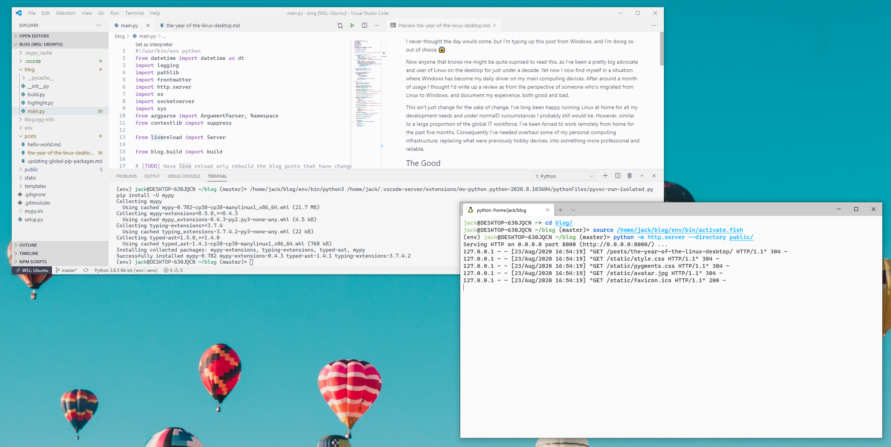

I never thought the day would come, but I'm typing up this post from Windows, and I'm doing so out of choice 😱.

Anyone technical that knows me  might be quite surprised to read this, as I've been an advocate (and user of) Linux for just under a decade. Yet, now I find myself in a situation where Windows has become my daily driver. After around a month of usage I thought I'd write a review from the perspective of someone whose migrated from Linux to Windows, and document my experience, both good and bad.

This isn't just change for the sake of change, I've long been happy running Linux at home for all my development needs and under normal circumstances I probably still would be. However, similar to a large proportion of the global IT workforce, I've been forced to work remotely from home for the past five months. Consequently I've needed overhaul some of my personal computing infrastructure, replacing what were previously hobby devices, into something more professional and reliable.

Business applications such as Citrix work well enough on Linux, but I repeatedly ran into issues that I just haven't experienced with Windows at all.

## The Good

Let's start with the good. After about a decade of using Linux on the desktop, switching to Windows felt like a very daunting prospect. I'm fairly pleased to announce that the process has been fairly seamless. So much so that after taking this experimental leap, I fear I may never feel compelled to return to Linux (if only in a hobby capacity).

### Windows Subsystem for Linux (WSL)

My Linux development setup was very straight forward, nothing complex. To do most of my hobby development projects I just need the following things:

- A web browser
- A terminal
- A text editor (typically neovim in the terminal)

Consequently it's be surprisingly trivial to replicate my regular Linux workflow within Windows by leveraging WSL. The bonus, if I ever need a clean slate to work from, I can simply reinstall the target OS.

The biggest surprise for me is how nicely integrated WSL is with the host OS. I'm able to open up files in VSCode running in a special WSL mode and everything 'just works'. Another handy thing is being able to open up the native Windows File explorer from within WSL, this makes it trivial to transfer files between the host OS and the mounted file system.

Maybe I'm just getting old, but it's pleasant how a lot of things now just seamlessly work, there's no more battling with 

### Applications

I'm able to reliably talk to my friends on Discord without the application consistently segfaulting.

## Things that work out of the box

### Drivers

### Power management settings

On windows I'm finally able to configure certain power management tools that were previously virtually impossible to achieve under Linux.

A prime example of this is using the Lenovo Vantage tool to configure my laptop battery maximum charge capacity. Having recently purchased a replacement battery of eBay for my venerable little Thinkpad x220 this should help dramatically improve battery longevity. On Linux I'm sure this would have been possible, but I'd have probably had to jump through numerous hoops or install some janky power management application.

## The Bad

### Font Rendering

After a month of usage I think I've finally come to terms with just now awful the font rendering is on Windows.

What's frustrating is applications such as VSCode and Windows Terminal appear to render font nicely, and others appear to not. The resulting effect means it's completely jarring when you switch between applications.

### Window Management

In general things appear to be very responsive on my machine, however I'd appreciate a better way to get a window overview for windows spanning all desktops.